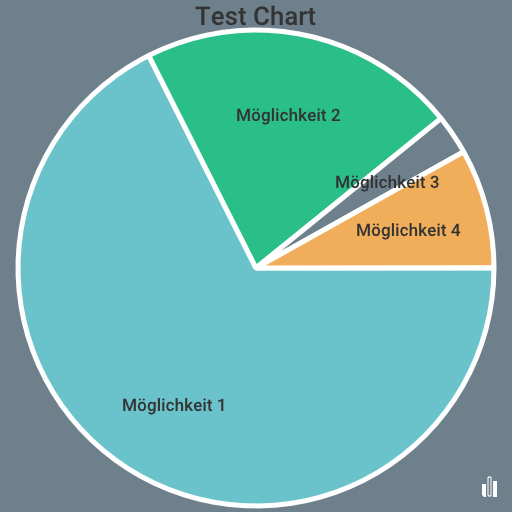

# Piechart Service for Votebot

> the votebot authors

## Usecase

After a poll is completed, the user is presented with an image displaying the results as a pie chart. The single purpose of this repository is to provide a simple REST Endpoint to generate these images.

## Usage

Post request to endpoint `/create` with body in a form like this:

######Example
```json
{
  "title": "Test Chart",
  "width": 512,
  "height": 512,
  "votes": [
    {
      "vote_count": 25,
      "title": "Möglichkeit 1"
    },
    {
      "vote_count": 8,
      "title": "Möglichkeit 2"
    },
    {
      "vote_count": 1,
      "title": "Möglichkeit 3"
    },
    {
      "vote_count": 3,
      "title": "Möglichkeit 4"
    }
  ]
}
```

You will receive an image similar to this 



## Config

You have different configuration parameters via environment variables

`PIECHART_DEV: boolean`

`PIECHART_BIND_ADDRESS: string`

`PIECHART_SENTRY_DSN: string`